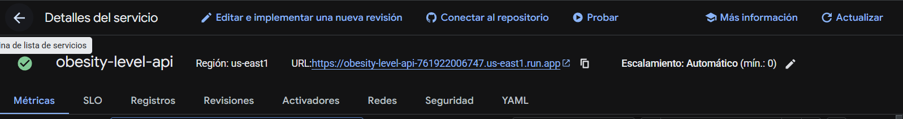
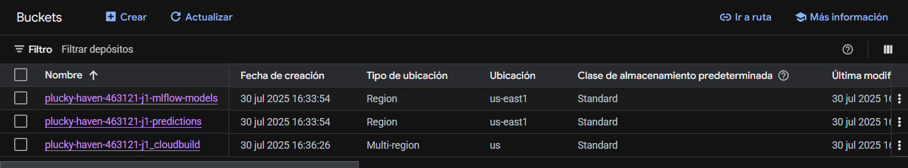
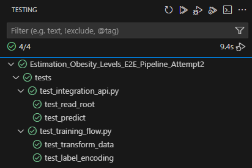
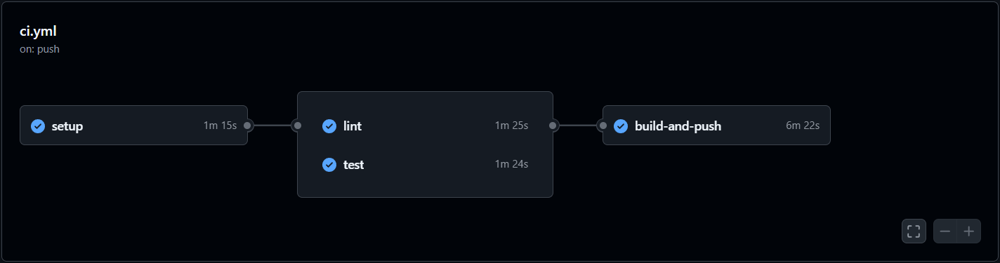

# Estimation Obesity Levels - E2E Pipeline - Attempt2


## 🩺 Problem Description

Obesity is a major public health concern worldwide. Its impact spans across cardiovascular diseases, diabetes, certain types of cancer, and reduced quality of life. The early identification of individuals at risk of obesity — through lifestyle and physical indicators — is essential for timely intervention and prevention strategies.

In this context, machine learning provides powerful tools to analyze patterns in personal habits and physiological features that may contribute to obesity. However, building a useful ML system goes beyond just training a model — it requires designing a robust pipeline that is reproducible, testable, scalable, and ready for deployment and monitoring in real environments.

This project addresses exactly that need.

We tackle the **multi-class classification problem** of predicting an individual's **obesity level**, based on their:
- eating habits (e.g. number of meals, snack frequency, calorie monitoring)
- physical characteristics (age, weight, height, physical activity)
- lifestyle choices (alcohol consumption, technology use, transportation, etc.)

The objective is to predict one of seven obesity categories:

1. Insufficient Weight
2. Normal Weight
3. Overweight Level I
4. Overweight Level II
5. Obesity Type I
6. Obesity Type II
7. Obesity Type III

---

## 🔄 Project Background

This repository is the **MLOps extension** of my previous machine learning project developed during the [MLZoomcamp](https://github.com/DataTalksClub/machine-learning-zoomcamp) midterm.

You can find the original project and its Jupyter notebook analysis here:

👉 https://github.com/aletbm/Estimation_Obesity_Levels

While the original repository focused on:
- Exploratory data analysis (EDA)
- Data preprocessing and feature engineering
- Benchmarking multiple models (CatBoost, XGBoost, Neural Networks, etc.)
- Model selection based on performance metrics

**This repository extends that work into a full end-to-end MLOps pipeline**, integrating best practices and tools to enable:

- Automated training workflows with **Prefect**
- Experiment tracking and model registry using **MLflow**
- Deployment of models via **FastAPI** and **Docker**
- Cloud provisioning with **Terraform** on **Google Cloud Platform (GCP)**
- Continuous monitoring with **Evidently AI**
- CI/CD automation with **GitHub Actions**
- Testing, validation, and reproducibility via **pytest** and **pre-commit hooks**

---

### 📦 Dataset: Obesity dataset (UCI Repository)

The dataset was obtained from the [UC Irvine Machine Learning Repository](https://archive.ics.uci.edu/dataset/544) and includes individuals from **Colombia, Peru, and Mexico**.

Key characteristics:

- 2,111 samples, 17 features + target label
- Obesity levels classified as:
  - **Insufficient Weight**
  - **Normal Weight**
  - **Overweight Level I**
  - **Overweight Level II**
  - **Obesity Type I**
  - **Obesity Type II**
  - **Obesity Type III**
- 77% of the samples are synthetic (generated using SMOTE), 23% are real.

The target variable is `NObesity` and features include age, gender, water intake, vegetable consumption, physical activity, snack frequency, and others.

---

### 🎯 Goal

To build a **production-ready MLOps pipeline** that:

- Trains and evaluates multiple ML models
- Logs artifacts and metrics using **MLflow**
- Serves predictions via a **FastAPI** service
- Monitors model quality and data drift using **Evidently**
- Deploys infrastructure with **Terraform** on **GCP**
- Orchestrates workflows with **Prefect**

The final model used in production is a **CatBoostClassifier**, selected based on best AUC and F1-score.

---

### ⚙️ Technologies and architecture

- **MLflow**: Experiment tracking and model registry
- **Prefect**: Flow orchestration
- **FastAPI**: RESTful API for predictions
- **Docker**: Containerization
- **Terraform**: Infrastructure provisioning (GCP)
- **Evidently**: Monitoring and drift detection
- **CloudPickle**: Model serialization
- **GitHub Actions**: Continuous Integration

---

### 📁 Project structure

```bash
.
├── .env                         # Variables de entorno (Slack, GCP credentials, etc.)
├── .gitignore                   # Archivos y carpetas ignoradas por Git
├── .gitmodules                 # Submódulos de Git (analysis como subrepo)
├── .pre-commit-config.yaml     # Configuración para pre-commit hooks (lint, black, etc.)
├── config.py                   # Configuración global del proyecto
├── Dockerfile                  # Define cómo se construye la imagen Docker para FastAPI
├── Makefile                    # Comandos automáticos para desarrollo, testing y despliegue
├── mlflow.db                   # Base de datos local de seguimiento de experimentos MLflow
├── Pipfile / Pipfile.lock      # Gestión del entorno virtual (pipenv)
├── README.md                   # Documentación principal del proyecto
├── requirements.txt            # Alternativa de dependencias (para Docker o CI/CD)
│
├── analysis/                   # Submódulo con análisis exploratorio y PDF del informe
│   ├── analysis/
│   │   ├── notebook.ipynb      # Exploración de datos y entrenamiento de modelos
│   │   └── notebook.pdf        # Versión en PDF del notebook (entregable del curso)
│   ├── dataset/
│   │   └── ObesityDataSet_raw_and_data_sinthetic.csv
│   ├── model/
│   │   └── obesity-levels-model.bin  # Modelo serializado con cloudpickle
│   ├── scripts/
│   │   ├── train.py            # Script de entrenamiento standalone
│   │   ├── predict.py          # Script para inferencia standalone
│   │   └── test.py             # Test unitarios para modelos
│   └── src/
│       └── aws.gif             # Imagen usada en el README (diagrama o ilustración)
│
├── data/
│   └── ObesityDataSet_raw_and_data_sinthetic.csv   # Dataset original o copia local
│
├── models/
│   └── [MLflow structure]      # Registros de modelos versionados y artefactos (label encoder, scaler, etc.)
│
├── output/
│   └── predictions.parquet     # Resultados de inferencia en lote
│
├── pipelines/
│   ├── training_flow.py        # Flujo Prefect: preprocesamiento, entrenamiento, evaluación
│   ├── promote_model_flow.py   # Flujo para promover modelos en producción
│   └── batch_inference.py      # Flujo para hacer inferencia por lotes con modelos registrados
│
├── deployment/
│   ├── serve.py                # API FastAPI para exponer el modelo
│   └── test_serve.py           # Test de integración para el endpoint `/predict`
│
├── monitoring/
│   ├── monitor.py              # Script que genera reportes Evidently y verifica drift
│   ├── full_monitor_report.html  # Reporte completo de monitoreo (Evidently)
│   └── artifacts/
│       └── preprocessing/      # Preprocesadores usados en monitoreo
│
├── infra/
│   ├── main.tf                 # Infraestructura principal: buckets, Cloud Run, permisos
│   ├── terraform.tfvars        # Variables del proyecto y región de GCP
│   ├── variables.tf            # Declaración de variables usadas en el .tfvars
│   └── terraform.tfstate*      # Archivos generados por Terraform tras aplicar infraestructura
│
├── scripts/
│   └── list_registered_models.py  # Script auxiliar para listar modelos en MLflow
│
├── tests/
│   ├── test_training_flow.py   # Test unitario para pipeline Prefect
│   ├── test_integration_api.py # Test de integración para API FastAPI
│   └── __init__.py             # Inicializador del módulo de tests
│
└── .github/workflows/
    └── ci.yml                  # Configuración CI con GitHub Actions (test + lint automático)
```

---

## 🧭 Project usage guide

This section walks through the usage of the project in detail, from setting up the environment to training the model, deploying the service, running monitoring, and executing tests.

---

### 🧪 1. Environment setup

Before using any functionality, ensure you have the required tools installed:

- Python ≥ 3.10
- [Pipenv](https://pipenv.pypa.io)
- [Docker](https://www.docker.com/)
- [Terraform](https://developer.hashicorp.com/terraform)
- [Google Cloud SDK](https://cloud.google.com/sdk)

Then, run the following command to install dependencies:

```bash
make install
```

This will create a virtual environment using `pipenv` and install all the packages defined in `Pipfile`. After installation, activate the environment:

```bash
make shell
```

Finally, ensure your `.env` file is correctly configured with sensitive values, such as:

```env
SLACK_WEBHOOK_URL=https://hooks.slack.com/services/...
```

This will be used for alerting during model monitoring.

---

### ⚙️ 2. Training pipeline with Prefect and MLflow

To track experiments and orchestrate training, run:

```bash
make run-mlflow        # Launch MLflow server on localhost:5000
make run-prefect       # Launch Prefect UI on localhost:4200
make run-training ALIAS=YourModelAlias      # Trigger full training flow
```

The pipeline performs the following steps:

1. Loads and deduplicates the dataset.
2. Renames and encodes features.
3. Applies standardization and one-hot encoding.
4. Trains and evaluates a CatBoostClassifier model.
5. Registers the model in MLflow.
6. Upload model artifacts to Google Cloud Storage.

Each run is logged with detailed metrics (AUC, F1, precision, etc.), artifacts, and preprocessed pipelines.

---

### 🚀 3. API Serving with FastAPI and Docker

After a model is trained and saved, you can serve it using FastAPI:

```bash
make run-api
```

This builds the Docker image, starts a container, and serves the API on `http://localhost:8080`. The API includes a `/predict` endpoint that expects a JSON payload. You can test it with:

```bash
make test-remote
```

This sends a real HTTP request to the API and prints the predicted class.

⚠️ Configuration notes

To make the API work correctly with your trained model and desired environment:

- In deployment/serve.py, make sure to set the correct RUN_ID, which corresponds to the ID of the model version you want to serve from MLflow. For example:

```python
# Remote endpoint (Cloud Run)
API_URL = "https://obesity-level-api-761922006747.us-east1.run.app/predict"

# Local endpoint
API_URL = "http://localhost:8080/predict"
```

## Remember to uncomment the correct API_URL based on your testing setup and comment out the unused one. This ensures the request is sent to the proper location for prediction.

### 🧱 4. Docker build and deployment to GCP

To build and deploy the API using Google Cloud:

1. Build the image:

```bash
make build-image
```

2. Authenticate with your GCP project:

```bash
gcloud auth login
gcloud config set project YOUR_PROJECT_ID
```

3. Push the image to Google Container Registry (GCR):

```bash
make gcloud-build
```

Make sure the values of `IMAGE_NAME` and `TAG` in the `Makefile` match your GCR path.

---

### ☁️ 5. Infrastructure provisioning with Terraform

To deploy infrastructure on GCP:

```bash
make terraform-deploy
```

This creates the following resources:

- Cloud Run service for model serving
    
- Public IAM access for the API
- GCS buckets for predictions and model storage
    

You can remove all resources with:

```bash
make terraform-destroy
```

Configure your GCP project and region in `infra/terraform.tfvars`. Ensure bucket names are globally unique.

---

### 📊 6. Monitoring with Evidently

Monitor model drift and prediction quality using:

```bash
make run-monitoring ALIAS=YourModelAlias
```


https://github.com/user-attachments/assets/2b04fecf-8d1e-419b-bb4e-e26b8c0e3ae9


This compares a new batch of predictions against expected values and generates:

- `monitoring/full_monitor_report.html`: Detailed drift and performance report
- Slack alert if drift exceeds threshold

The monitoring logic also triggers automatic retraining via Prefect if drift is detected — closing the MLOps feedback loop.

---

### ✅ 7. Testing and code quality

Run static checks and tests using:

```bash
make lint      # Runs pre-commit hooks: black, flake8, etc.
make test      # Executes unit and integration tests
```



Tests include:

- **test_training_flow.py**: Validates the data preprocessing and label encoding pipeline steps, verifying the consistency of transformations and encoding with expected behavior.
- **test_integration_api.py**: Uses FastAPI TestClient to send requests to the / and /predict endpoints, checking response status codes and expected JSON keys.

These tests help ensure reproducibility, correctness of data pipeline logic, and production readiness of the API.

---

### 🔁 8. CI/CD Integration

The `.github/workflows/ci.yml` file defines a GitHub Actions workflow that automatically runs on every push and pull request to the main branch to ensure code quality and functionality.



The workflow includes the following jobs:

- setup: Checks out the code, sets up Python 3.10, and installs dependencies using pipenv.
- lint: Runs pre-commit hooks (e.g., formatting and linting with black, flake8) on all files to enforce code style and quality.
- test: Executes all tests using pytest, with the option to skip model-heavy tests via the SKIP_MODEL_TESTS environment variable.
- build-and-push: After successful lint and test jobs, builds the Docker image and pushes it to Google Container Registry (GCR) using authenticated GCP service account credentials.

This CI/CD pipeline helps maintain reproducible builds, enforces quality standards, and automates deployment preparation.

> Note: The `secrets.GCP_SA_KEY` referenced in the workflow is a GitHub secret that must be configured in your repository settings. It should contain the JSON credentials file of your Google Cloud Service Account. This secret enables the workflow to authenticate securely with GCP for building and pushing Docker images.

## 📈 Model Performance

| Model               | ROC AUC  | F1-Score | Accuracy |
| ------------------- | -------- | -------- | -------- |
| Logistic Regression | 0.89     | 0.62     | 0.63     |
| Decision Tree       | 0.92     | 0.68     | 0.68     |
| Random Forest       | 0.97     | 0.84     | 0.84     |
| XGBoost             | 0.98     | 0.87     | 0.87     |
| **CatBoost**        | **0.98** | **0.89** | **0.89** |
| Neural Network      | 0.96     | 0.83     | 0.83     |

The **CatBoost model** was selected for production based on its superior ROC AUC and F1 performance.

---

# 🛠️ Makefile Usage Summary (with ALIAS support)

| Command                                  | Description                                                     |
| ---------------------------------------- | --------------------------------------------------------------- |
| make install                             | Install all project dependencies using pipenv                   |
| make shell                               | Open a pipenv shell environment                                 |
| make lint                                | Run code quality checks using pre-commit                        |
| make test                                | Run all tests in the tests/ directory using pytest              |
| make test-remote                         | Run API integration test for /predict endpoint                  |
| make run-training ALIAS=YourModelAlias   | Execute the Prefect training pipeline using a given model alias |
| make run-monitoring ALIAS=YourModelAlias | Run the Evidently monitoring script using a given model alias   |
| make run-inference ALIAS=YourModelAlias  | Run batch inference using the specified model alias             |
| make run-api                             | Build and run the FastAPI service locally in a Docker container |
| make run-mlflow                          | Start the MLflow tracking server locally                        |
| make run-prefect                         | Start the Prefect server locally                                |
| make build-image                         | Build Docker image locally (tagged obesity-level-api)           |
| make gcloud-build                        | Build and push Docker image to Google Container Registry (GCR)  |
| make terraform-deploy                    | Initialize, plan, and apply infrastructure using Terraform      |
| make terraform-destroy                   | Destroy infrastructure managed by Terraform                     |
| make deploy-gcp                          | Deploy container image to Google Cloud Run                      |
| make list-models                         | List all MLflow registered models (via helper script)           |

> ✅ Use make <command> from the project root.
✅ For commands that require ALIAS, replace YourModelAlias with the name of your registered MLflow model.
---

This repository delivers a full MLOps pipeline, from data ingestion to deployment and monitoring, around the **Obesity Estimation** task. It adheres to best practices for reproducibility, cloud infrastructure, and CI/CD automation.
